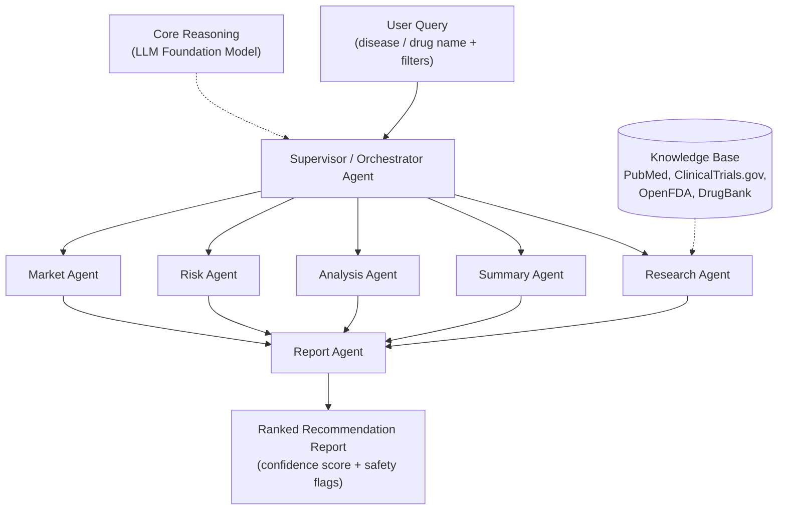

# Multi-Agent Drug Repurposing System

A multi-agent LLM system that aims to identify and evaluate **drug repurposing candidates**, meaning new therapeutic uses for existing drugs. A supervisor agent coordinates specialised agents that gather biomedical evidence, analyse it, assess risk and market potential, and produce a structured report.

> **Status: In development (started Sep 2026).**
> The system architecture and design are documented here. Implementation is in progress, and the sections below clearly mark what is designed versus built.

---

## Table of Contents
- [Motivation](#motivation)
- [System Architecture](#system-architecture)
- [Agents](#agents)
- [Knowledge Sources](#knowledge-sources)
- [Planned Workflow](#planned-workflow)
- [Tech Stack](#tech-stack)
- [Roadmap](#roadmap)
- [Research Paper](#research-paper)
- [Disclaimer](#disclaimer)
- [Author](#author)

---

## Motivation

Developing a new drug is slow and expensive. Repurposing an existing, already-approved drug can shorten that path, but finding good candidates means reading across scientific literature, clinical trial registries, regulatory data and drug databases. This project explores whether a **multi-agent LLM architecture** can split that work into focused roles and combine the results into one evidence-grounded report.

---

## System Architecture

High-level view:

The architecture has four layers: a user interface layer, an agent orchestration layer, a core reasoning layer (LLM foundation model), and a knowledge base layer.

---

## Agents

| Agent | Role |
|-------|------|
| **Supervisor Agent** | Interprets the query, routes tasks to the other agents, and coordinates their outputs |
| **Research Agent** | Retrieves relevant literature, trial and drug data from the knowledge sources |
| **Summary Agent** | Condenses retrieved material into concise, source-linked summaries |
| **Analysis Agent** | Evaluates evidence for a possible new indication of the drug |
| **Risk Agent** | Looks at safety and adverse-event information relevant to the candidate |
| **Market Agent** | Considers market and commercial context for the candidate |
| **Report Agent** | Combines all agent outputs into a ranked recommendation report (confidence score + safety flags) |

---

## Knowledge Sources

- **PubMed** for biomedical literature
- **ClinicalTrials.gov** for clinical trial records
- **OpenFDA** for regulatory and adverse-event data
- **DrugBank** for drug and target information

---

## Planned Workflow

1. The user submits a drug and/or disease of interest.
2. The Supervisor Agent breaks the request into sub-tasks.
3. The Research Agent queries the knowledge sources through tool calls.
4. The Summary and Analysis Agents process the retrieved evidence.
5. The Risk and Market Agents run their own assessments.
6. 

---

## Tech Stack

- **Language:** Python
- **LLM:** LLM API *(provider to be finalised)*
- **Data sources:** PubMed, ClinicalTrials.gov, OpenFDA, DrugBank

---

## Roadmap

- [x] Problem definition and literature review
- [x] Multi-agent architecture design
- [x] Agent roles and knowledge sources defined
- [ ] Data-source connectors (PubMed, ClinicalTrials.gov, OpenFDA, DrugBank)
- [ ] Supervisor agent and task routing
- [ ] Research, Summary and Analysis agents
- [ ] Risk and Market agents
- [ ] Report generation
- [ ] Evaluation of output quality and source grounding
- [ ] Demo / user interface

---

## Research Paper

An IEEE-style review paper on this system is **in preparation** and has not been published yet.

Authors: Stephey Anton Fernandes, Shrushti A. Chavan, Shreya S. Todkar, Rucha R. Khabale.

---

## Disclaimer

This is an academic and research project. Its outputs are **not medical advice** and must not be used for clinical or treatment decisions.

---

## Author

**Stephey Anton Fernandes**
B.E. CSE (Data Science), D. Y. Patil College of Engineering & Technology, Kolhapur
GitHub: [stephey23](https://github.com/stephey23) | LinkedIn: [stepheyfernandes](https://linkedin.com/in/stepheyfernandes)
